# Apotheosis: Feature Reference

iOS + tvOS client. Emby, Xtream Codes, M3U/XMLTV behind one player. Built by someone who wanted one app to do everything.

What you get: a 70k-channel EPG that doesn't choke, Continue Watching that merges across every source you've connected, and dedup that treats your 4K and 1080p copies of the same film as one tile. Plus AirPlay that actually works on MKV via Emby transcode, a Worker-backed bug reporter that holds nothing about you, and security posture closer to a password manager than a typical media app.

---

## Upcoming During Beta

Queued for the beta period. If something's missing, check here first.

- **Skip Intro / Skip Credits.** The infrastructure ships in beta (chapter-marker reader, overlay component, VLC-path mount). The button shows up when your server has named chapter markers from the Chapter Markers plugin. Default Emby chapters are unnamed five-minute fillers, so the heuristic gets a fallback during the beta period to catch more catalogs.
- **Fine-scrub.** Tap-to-seek and drag are shipped. The hold-and-slide-up precision gesture is coming.
- **In-player channel list overlay.** Pick a new channel without dismissing the player first.
- **Fresh-drop priority in Continue Watching.** When a new episode releases for a show you're caught up on, it jumps to the front of CW instead of getting buried behind everything else you've been watching that week.
- **Jellyfin support.** Adding alongside Emby. The two share most of the API surface, so most of the existing Emby code carries over.
- **iPad and tvOS layout pass.** Playback works on both. Discovery layouts are tuned for iPhone right now.

---

## Future Features

Post-beta. Not in the current build.

- **Custom player.** Ground-up replacement for the AVPlayer + VLC composition. Tighter engine integration, frame-accurate chapter nav, better HDR / Dolby Vision path.
- **Plex source.** Separate OAuth and library model.
- **Trakt sync.** Cross-device watch history and ratings. Bundled with TMDB integration so XC content gets proper cast and crew metadata.
- **Multi-server.** Connect more than one Emby server at the same time (XC and M3U too, eventually). Each server gets its own libraries, customizations, and credentials. The per-server settings page is already laid out for this; the underlying storage refactor is the rest.
- **Multi-profile / household.** v1 is single-user by design. Parental controls and per-profile state (resume positions, favorites, watch history scoped per profile) land here.

---

## Sources

### Emby

**Resume integration.** Watch in Apotheosis, it shows up in the Emby web client within seconds. Watch in the web client, it shows up here on next refresh. Two-way without weird offsets.

**Favorites sync.** Both directions. Catches favorites in libraries that aren't otherwise queried, since the favorite list is pulled directly from the server's own filter rather than walking libraries.

**Mark as Watched / Unwatched.** Uses the canonical PlayedItems endpoint, which works across server versions. Some older builds silently no-op the JSON-body alternative, so that path is avoided.

**Emby Connect.** Federated login if you'd rather sign in with your Emby Connect account and pick a server from your list.

### Xtream Codes

VOD movies, VOD series, and Live TV.

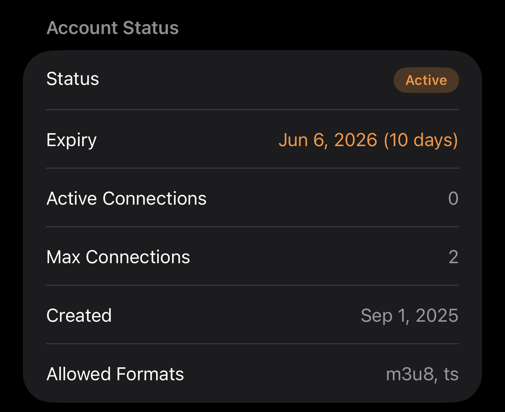

**Account status.** Expiry, active connections, and max connections surfaced in Settings with severity tiers (ok, warning, critical). You'll know your sub is about to lapse before it does.

**Continue Watching for VOD.** XC has no server-side resume endpoint, so position is stored locally. CW merges this with Emby's authoritative resume list, so the same title playing on both sources doesn't show up twice.

**Favorites.** Local-only, with an iCloud snapshot so they survive reinstalls and cross devices.

### M3U + XMLTV

Paste a URL. 70k+ channel playlists parse without hanging. Handles CRLF line endings correctly (a lot of parsers don't). File-backed storage bypasses the UserDefaults size cap.

XMLTV matched by `tvg-id`. External entity resolution disabled, since billion-laughs attacks are real for arbitrary EPG endpoints.

M3U and XC channels coexist in the same store via a separate ID namespace, so the channel list, EPG grid, favorites, and in-player navigation all treat them uniformly.

---

## Player

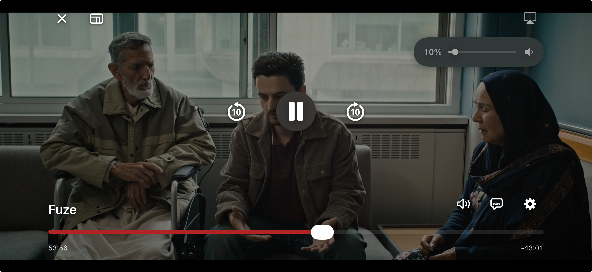

### Engine routing

AVPlayer for native Apple formats, VLC for everything else. Auto-fallback when AVPlayer rejects a container at startup, with a watchdog that catches HLS streams that hang silently. Force-engine override in Debug for testing the chrome against any content.

### Picture in Picture

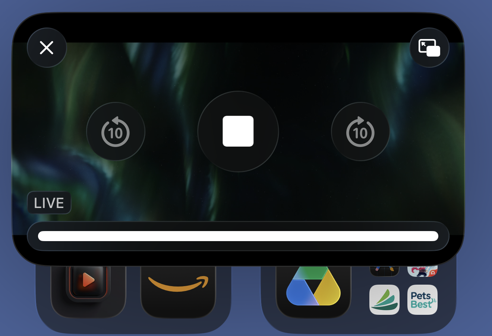

AVPlayer content backgrounds into the system PiP window when you press Home or pull Control Center. Tap the PiP button in the top-right cluster to enter it manually. VLC content (MKV, AVI, FLV, raw TS) doesn't support PiP yet, because libVLC frames don't enter AVFoundation's PiP pipeline. That gets unlocked when VLCKit 4.x lands post-beta. The button hides itself on VLC sessions so you're not staring at a control that doesn't work.

### AirPlay

VLC doesn't integrate with AirPlay, so MKV/AVI/FLV/raw TS content on VLC normally can't cast. Apotheosis watches `AVAudioSession` route changes; on AirPlay activation for an Emby item playing in VLC, it asks the Emby server for an HLS transcode via `PlaybackInfo` and swaps to AVPlayer at the current position. Swaps back when AirPlay disconnects. XC and M3U already route through AVPlayer, so AirPlay works there natively.

Heads up: AirPlay receivers enforce ATS independently of iOS, so a self-signed-cert Emby on LAN can't AirPlay to Apple TV. Use a real cert (Let's Encrypt or a reverse proxy).

### Volume

Drag on the left side, or grab the HUD track directly. The visible bar is a real slider. Writes to actual system volume, not just per-player gain. Hardware buttons mirror the HUD in real time. If Apple ever closes the system-volume path, it falls back to per-player gain automatically (VLC supports up to 200%).

### Brightness

Drag on the right side. Adjusts screen brightness without leaving the player.

### Mini player

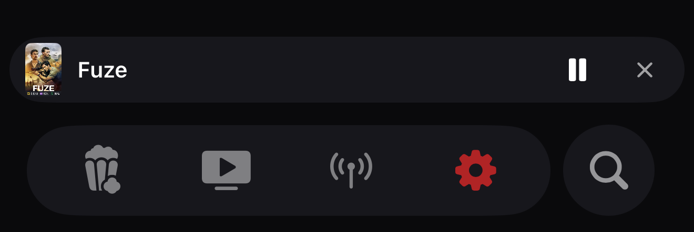

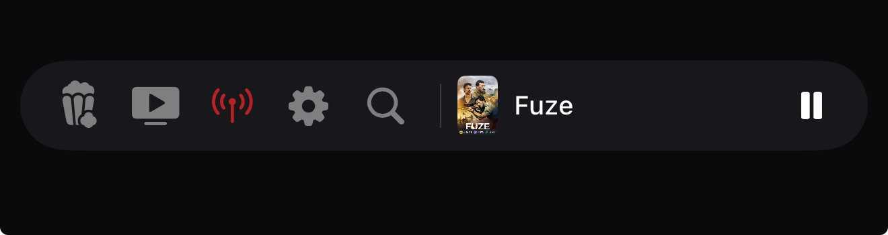

Engine stays alive while you browse. Three display states:

- Two-pill dock above the tab bar (normal).
- Compact inline pill when you scroll down. Tab icons compressed to the left, marquee title and play button on the right.
- Player-only pill on detail and settings pages where the tab bar is hidden.

Swipe down on the full-screen player to minimize, swipe up on the mini bar to expand, swipe down to dismiss. Final position reports to Emby on every transition.

### Tap-to-seek

Tap anywhere on the scrub bar to jump there. Drag for fine control.

### Episode navigation

In-player episode list, plus prev/next skip buttons. Same in-place URL swap. Chrome stays mounted, engine reloads, no dismiss animation.

### Track persistence

Audio and subtitle preferences carry across episodes of the same series. Set Spanish audio on episode 1, episodes 2 through 12 open in Spanish.

### Auto-mark watched

Fires at 95% of runtime, settings toggle, default on. Matches VidHub's behaviour.

---

## Live TV

### EPG grid

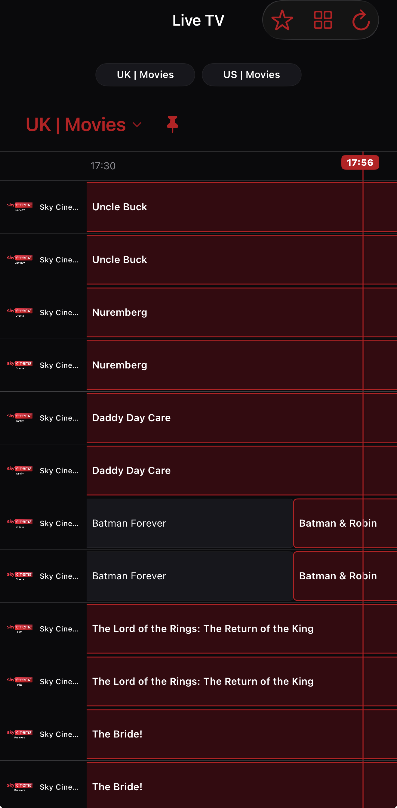

Sticky channel column, continuous horizontal time scroll, and a current-time indicator that follows the playhead. Slot width adapts to orientation: about 30 minutes visible in portrait, an hour in landscape, so 15-minute filler programmes on news, kids', or shopping channels render readably instead of compressed to one-letter stubs. The sticky time pill stays glued to the Now line through scrub, rather than snapping in hour-sized jumps.

Channels with empty or 503 EPG endpoints borrow programme data from siblings sharing the same EPG ID, so HD/SD/FHD variants of the same channel all populate even if only one has a working endpoint. If a channel comes back empty without a sibling to borrow from, it retries once after a delay (XC providers sometimes return empty under burst load at app launch; one quiet retry catches those).

Adjacent programmes that overlap in the schedule data (a "show A ends 13:05, show B starts 13:00" situation, common in XC feeds) get trimmed at ingestion so tiles butt up cleanly in the grid instead of stacking on top of each other.

Rows actively fetching show greyed placeholder tiles with a moving gradient sweep. Rows that came back empty show "No EPG data" with a small icon at the leading edge, so you can tell at a glance whether to wait or move on. The shimmer runs on Core Animation, which keeps the sweep smooth even while the main thread is busy decoding the rest of the EPG batch.

### Quick Chips

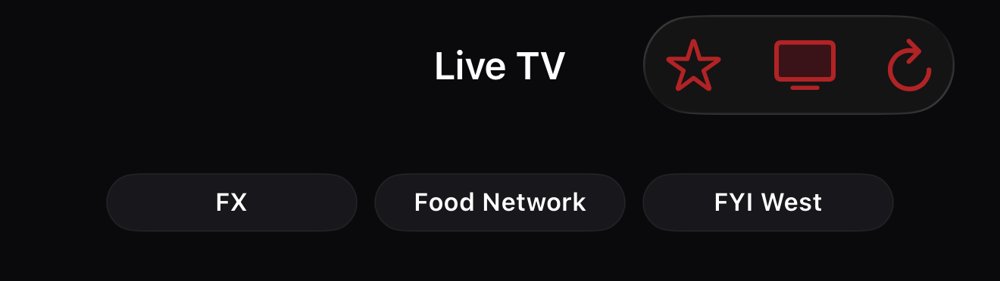

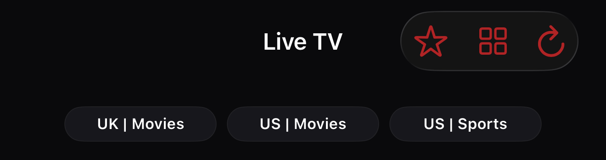

Pinnable shortcuts above the category dropdown. Two modes: channel pins for one-tap-to-play, or category pins for one-tap-to-filter. Independent lists per mode. Cap is 10 per mode, scrollable horizontally when chips exceed the visible row. Long-press any chip to remove it with a brief toast confirmation.

The current category has its own pin button next to the dropdown title, so you can add or remove the category you're already browsing without going into Settings. Channel pin/unpin from the EPG long-press menu fires the same toast. If you're in the wrong chip-kind mode when you pin, the toast tells you where the new chip will appear.

### In-player channel nav

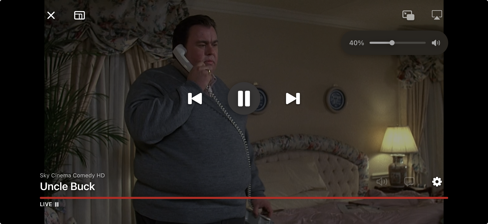

Prev/next channel buttons replace seek controls on live streams. Order follows the active EPG filter. If you're in Sky Sports and tap next, you get the next Sky Sports channel, not the next channel in the full list. In-place swap, no dismiss animation.

---

## Discovery

### Sibling versioning

| **Apotheosis** | **Infuse** |
|:---:|:---:|
| 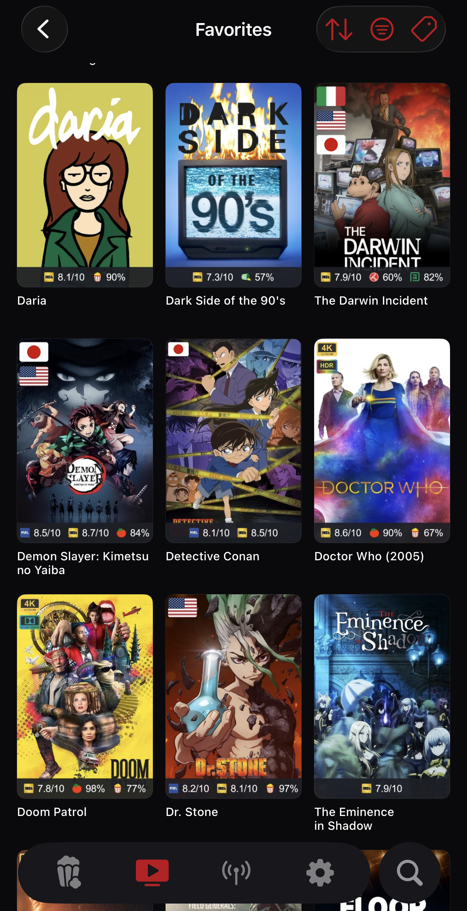 |  |

Multi-encode libraries are common in IPTV-plus-personal-server setups. Your Emby has separate 4K and 1080p folders. Your IPTV provider lists the same movie at three resolutions. Most clients show all of them, so the same title sprawls across rails, fills CW with duplicates, and ends up with a watched checkmark that only applies to one variant.

Apotheosis collapses them into a single tile across every grid, every CW rail, every search result. Resolution chips on the detail page let you switch versions. The CW play button respects whichever you picked last, and marking either version watched clears both. Server data is untouched; the dedup is purely client-side, so your Emby web client still sees each version separately if that's how you want to browse there.

Count the duplicates above.

### Continue Watching

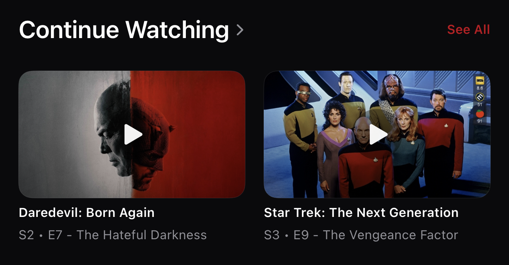

Hero carousel, two cards visible. Tap the centred play button to resume directly. Tap anywhere else to open detail.

Cross-source: Emby and XC VOD share one rail. The sibling-aware dedup covered above keeps the rail clean when the same title exists in multiple places. The tile flips to whichever version you played most recently, so the artwork you see matches the version that actually plays.

### Custom Rails

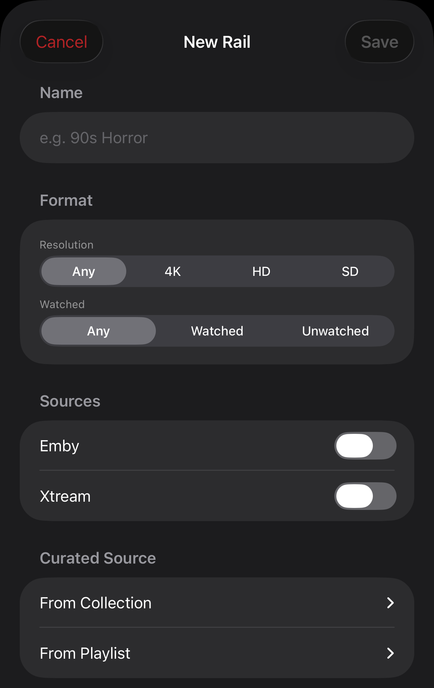

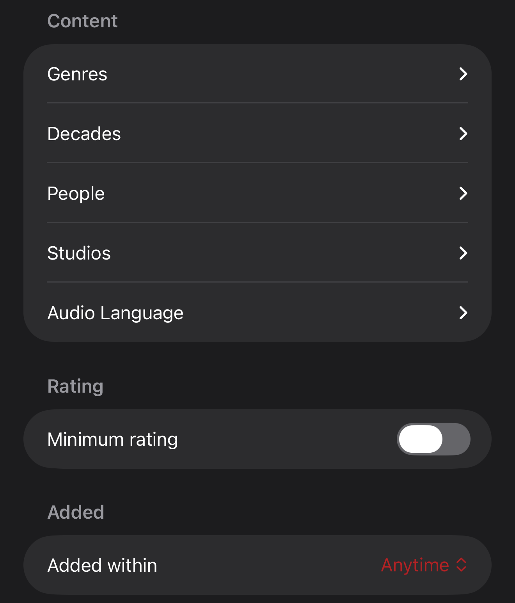

Composable filter rails on the discovery screen. 11 axes available: genre, decade, source, person, rating floor, resolution, watched state, recency, studio, audio language, and curated source (Emby BoxSets or Playlists).

Person autocompletes against the Emby cast/crew index. Type "Villeneuve" and get a filmography rail.

### Genre, Favorites, Collections, Playlists, Recently Added

Nav chips above the rails, each opens a full grid with sort overrides, source filtering, and genre filtering. Genre chips come from your library's actual tags, sorted by item count descending.

### Library load

First 1000 items per library load immediately. Anything beyond that fills in the background while the UI is already showing the first page. Capped per library at 5000. Libraries beyond that are almost certainly not personal collections.

### See All

First 100 items paint immediately, next 100 trigger as you scroll near the end. No artificial cap. Spinner sits in the trailing grid cell while the next page loads.

Title sort ignores leading articles. "The Pact" lands under P, not jammed into a wall of "The X" entries. Applies to the Title A→Z / Title Z→A sort and every tie-break that breaks on title (Date Added, Year, Rating).

### Watched state

Watched posters dim to 50% with a checkmark overlay. Recently Added hides watched items entirely. Other rails keep them visible-but-dimmed so rewatch is still findable.

### Mark watched up to

Long-press an episode card in series detail to mark every prior episode (plus that one) as watched. Same menu has full-series and full-season variants. Useful when you finally start tracking a show you watched ages ago.

Season chips on the series detail page have their own long-press for full-season marking, without needing to tap into the episode list. A toast confirms the action since the season's episodes may not be visible on the current surface.

---

## Search

Top-level tab with its own Liquid Glass circle next to the main pill (Apple Music / iOS 26 pattern). Searches across every configured source from one place. Five sections render in priority order:

- **Channels.** Live channel name matches. Tap to play.
- **On Now.** Programmes currently airing that match the query. Tap plays the parent channel; the search results act as the player's prev/next channel context.
- **Upcoming.** Programmes starting within the next 24 hours, with a relative time badge ("in 45m", "Tomorrow 9:00 PM").
- **Movies, Series, Episodes.** VOD results from Emby and XC combined. Cap of 20 per section with a "See All" pivot that expands without a second fetch.

Every result card has a long-press menu tuned to its type. Live cards offer Play Now, Go to EPG (jumps to LiveTV with the channel's category selected), Favorite, and Pin to Quick Channels. Movie cards offer resume-aware Play (centered "Continue watching?" prompt when there's a saved position), Favorite, Mark Watched, and Add to Playlist for Emby items. Series cards offer Play (auto-resumes the most recently progressed episode), Favorite, and Mark Series Watched. Episode cards offer Play, a Mark Watched submenu (Episode / Season / Up to This Episode), Series-scoped Favorite, and Add to Playlist. Toast confirms every action since the search surface doesn't reflect favorite or watched state visually.

Punctuation normalization handles iOS Smart Punctuation. Typing "guy's grocery games" with the smart-curly apostrophe and "guys grocery games" with no apostrophe both find the same titles. Same logic applied on both sides of every match, plus on the term sent to Emby's server-side search.

Opening the Search tab triggers a background EPG warm-up for your priority channels, capped at 20. Without it, Live programme matches would require a prior Live TV visit to populate the cache. When coverage is sparse, a small caption under On Now and Upcoming points back to Live TV to load more.

The Search circle has an 8pt invisible tap-padding extending past the visible edge, so glances that land slightly outside the button still hit Search instead of the content underneath.

---

## Navigation

### Custom tab bar

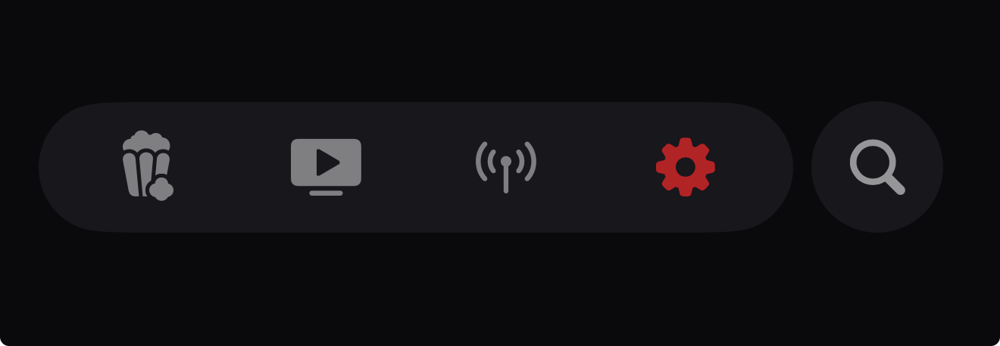

Replaces the system `TabView`. Movies, Series, Live TV, and Settings live in the main pill; Search sits in its own circle to the right. The iOS 26 Liquid Glass tab bar paints a persistent dark band that no SwiftUI or UITabBar API can remove. Apple DTS confirmed as intentional. The custom bar sidesteps this entirely.

### Slide to switch

Drag horizontally across the tab bar to glide between tabs. Light haptic per crossing. Tooltip swaps to the hovered tab's label immediately.

### Pop to root

Tap the active tab to pop back to its discovery view. Works for any push (drill-downs, See All, library views), regardless of how they were added.

### Tab bar behaviour

Hides on scroll-down with a 12pt threshold, restores on any upward scroll. Hides on drill-down pages where the active surface doesn't need tab context.

---

## Infrastructure

**Catalog cache.** Full library catalog persisted locally. Cold launch paints from cache in under 2 seconds on 30k+ item libraries.

**Discovery cache.** Snapshot written after each successful load. Tab re-entry renders from cache while a background refresh runs.

**Channel store.** File-backed (UserDefaults isn't built for 70k channels). iCloud snapshot trimmed to user-touched channels only (favorites, hides, pins), so KVS quota doesn't matter.

**Log buffer.** 500-entry actor-based ring buffer. Bug reports attach a filtered excerpt automatically. Console prints are gated to Debug builds only.

**Privacy.** No analytics, no tracking SDK, no third-party crash reporter that phones home. Bug reports go through a Cloudflare Worker that creates GitHub Issues server-side, so the GitHub token never ships in the binary.

---

## Things worth knowing about security

This app holds credentials for servers you don't own: Emby logins, XC subscriptions, M3U URLs, stream tokens. The threat model is closer to a password manager than a typical media app, and it's built that way deliberately.

- **No backend.** Apotheosis talks directly to your servers. There's no Apotheosis-controlled cloud holding anything about you.
- **No analytics, no tracking SDK, no third-party crash reporter that phones home.** Every dependency that exists in the app is there to render media or talk to your servers, not to phone home about you. This is also a supply-chain control. Anything that phones home is an exfiltration vector for the credentials this app holds.
- **Credentials live in the Keychain** with the "this device only" accessibility class. Per-profile isolation so a leak from one server doesn't compound across all of them.
- **TLS posture.** Apple's App Transport Security is enforced for any connection on the public internet. TLS 1.2+ with a valid cert is required for XC providers and any Emby server reachable from the open web. LAN networking has a carve-out for RFC 1918, link-local, `.local`, and loopback hosts, since self-hosted Emby commonly sits there with HTTP or a self-signed cert and that's the typical install. The trade-off: XC providers that only expose HTTP on the open web stop working in this build. Tighter posture (per-profile insecure opt-in, certificate pinning, server identity checks on first connect) lands in the next security round.
- **Bug reports redact credentials.** The in-app reporter strips anything that looks like a URL, token, or stored credential before it leaves the device. The pipeline that creates GitHub Issues holds nothing identifying server-side.

The full security spec lives in `CLAUDE.md` at the repo root. If you've ever sideloaded an IPTV app that uploaded your credentials somewhere shady, you'll appreciate the difference.

---

## Things worth knowing if you read the code

- `ItemKey` is the stable cross-source identity that threads through Resume, Favorites, TrackPreferences, and in-player nav. Don't bypass it.
- `PlayerControls` is engine-agnostic. The chrome doesn't know whether AVPlayer or VLC is rendering.
- System volume control is a grey-area MPVolumeView path. The fallback to per-player gain is automatic.
- Setting Emby audio/subtitle indices forces transcode mode. Only emit those parameters on explicit user intent.
