# Apotheosis: Feature Reference

iOS + tvOS client. Emby, Jellyfin, Plex, Xtream Codes, and M3U/XMLTV behind one player. Built by someone who wanted one app to do everything.

What you get: a 70k-channel EPG that doesn't choke, Continue Watching that merges across every source you've connected, and dedup that treats your 4K and 1080p copies of the same film as one tile. Direct-play MKV / HEVC / 4K HDR on phone and Apple TV through AetherEngine. Optional TMDB enrichment for clear logos and cast when your server's artwork is thin. A Worker-backed bug reporter that holds nothing about you, and security posture closer to a password manager than a typical media app.

  

<em>Apple TV discovery — full-bleed backdrop, clear logo, Play / Favorite / Info cluster.</em>

---

## Upcoming During Beta

Queued for the beta period. If something's missing, check here first.

- **Trakt.** Device OAuth + Keychain foundation is in (DEBUG Connect today). Full watch-history / ratings sync is next — Trakt is just around the corner.
- **Fresh-drop priority in Continue Watching.** Lands with the Trakt work: when a new episode releases for a show you're caught up on, it jumps to the front of CW instead of getting buried behind everything else you've been watching that week.
- **Fine-scrub.** Tap-to-seek and drag are shipped. The hold-and-slide-up precision gesture is coming.
- **iPad layout pass.** Discovery layouts are tuned for iPhone right now. Grid density, rail proportions, and the detail version picker all need a pass for the larger canvas. (Not in the current TestFlight cut.)
- **Plex parity leftovers.** Movie/TV libraries, Continue Watching (read of server progress), cast, and direct play are in. Still open: Live TV/DVR, Favorites sync to the Plex server, and writing playback progress back so other Plex clients see what you watched here.
- **Jellyfin road-testing.** Same Media Server path as Emby; early support. Kick the tires and report what differs.

---

## Future Features

Post-beta. Not in the current build.

- **Live TV update — in-player channel list.** Pick a new channel without dismissing the player first. Part of the larger Live TV pass, not a standalone polish item.
- **Multi-server.** Connect more than one Emby (or XC / M3U) at the same time. Each server gets its own libraries, customizations, and credentials. The per-server settings page is already laid out for this; the underlying storage refactor is the rest.
- **Multi-profile / household.** v1 is single-user by design. Parental controls and per-profile state (resume positions, favorites, watch history scoped per profile) land here.

---

## Sources

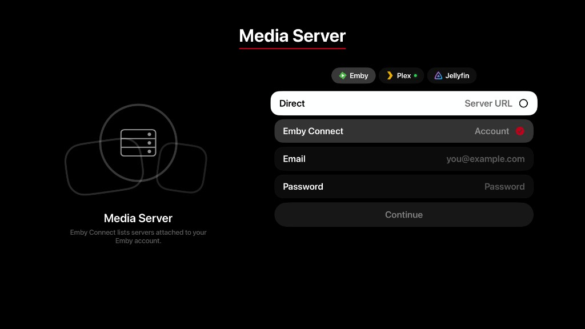

One Media Server screen for Emby, Plex, and Jellyfin (tabs above). Plex can sit alongside; Emby and Jellyfin share a slot. Direct URL or Emby Connect for Emby; same host/port form for Jellyfin.

### Emby

**Resume integration.** Watch in Apotheosis, it shows up in the Emby web client within seconds. Watch in the web client, it shows up here on next refresh. Two-way without weird offsets.

**Favorites sync.** Both directions. Catches favorites in libraries that aren't otherwise queried, since the favorite list is pulled directly from the server's own filter rather than walking libraries.

**Mark as Watched / Unwatched.** Uses the canonical PlayedItems endpoint, which works across server versions. Some older builds silently no-op the JSON-body alternative, so that path is avoided.

**Emby Connect.** Federated login if you'd rather sign in with your Emby Connect account and pick a server from your list.

**Chapters.** When the server has chapter markers, the in-player episodes/chapters control lists them (not buried in gear). Detail Play, Continue Watching, long-press Play, library / See All / Collections / Playlists, and Search all hydrate chapters the same way.

### Jellyfin

Add a Jellyfin server from the same Media Server screen as Emby. The app detects which one you're connecting to and reuses the Emby code path for library browsing, Continue Watching, and playback. Early support; treat gaps as reportable.

### Plex

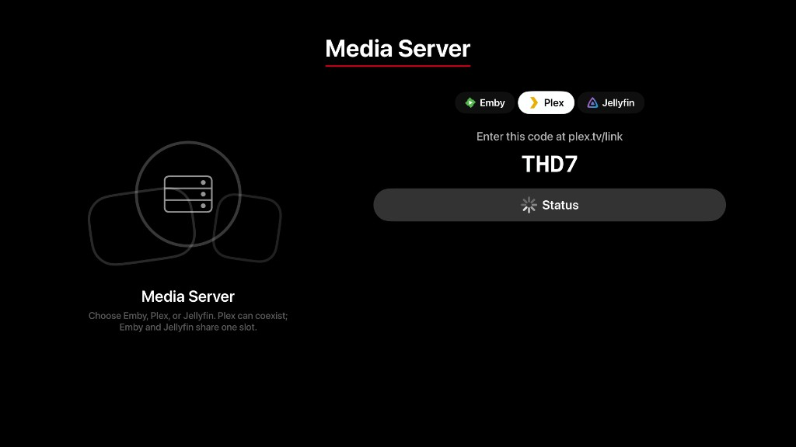

Sign in with a short code at plex.tv/link (Apple TV friendly — no on-screen password typing), then pick a server. Movie and TV libraries, Continue Watching (On Deck that picks up alongside Emby and IPTV), cast and crew, and direct play, with the same detail pages and in-player experience as everything else.

**Still to come:** Plex Live TV/DVR, Favorites sync to the server, and writing progress back so other Plex clients see what you watched inside Apotheosis. Local resume and watched state still work for Apotheosis itself.

### Xtream Codes

VOD movies, VOD series, and Live TV.

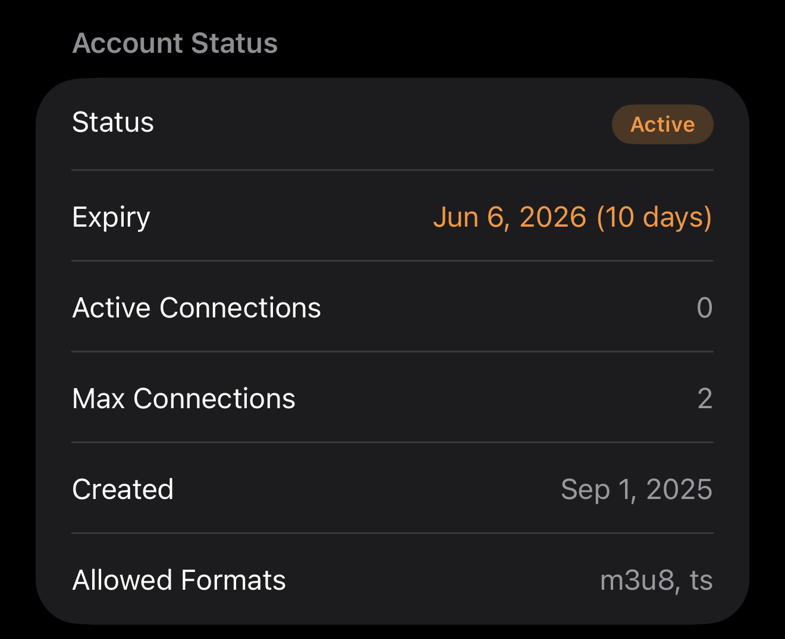

**Account status.** Expiry, active connections, and max connections surfaced in Settings with severity tiers (ok, warning, critical). You'll know your sub is about to lapse before it does.

**Continue Watching for VOD.** XC has no server-side resume endpoint, so position is stored locally. CW merges this with Emby's authoritative resume list, so the same title playing on both sources doesn't show up twice.

**Favorites.** Local-only, with an iCloud snapshot so they survive reinstalls and cross devices.

**Rating badges on poster art are baked in server-side, not app-rendered.** Some XC reseller catalogs (and some Emby posters, depending on the metadata agent) ship IMDb/Rotten Tomatoes/Metacritic/TMDB/Popcornmeter score badges burned directly into the poster/backdrop image graphic. Apotheosis has no ratings-aggregation client anywhere in the codebase. If badges are visible in a screenshot, they're pixels in the artwork, not UI Apotheosis drew.

### M3U + XMLTV

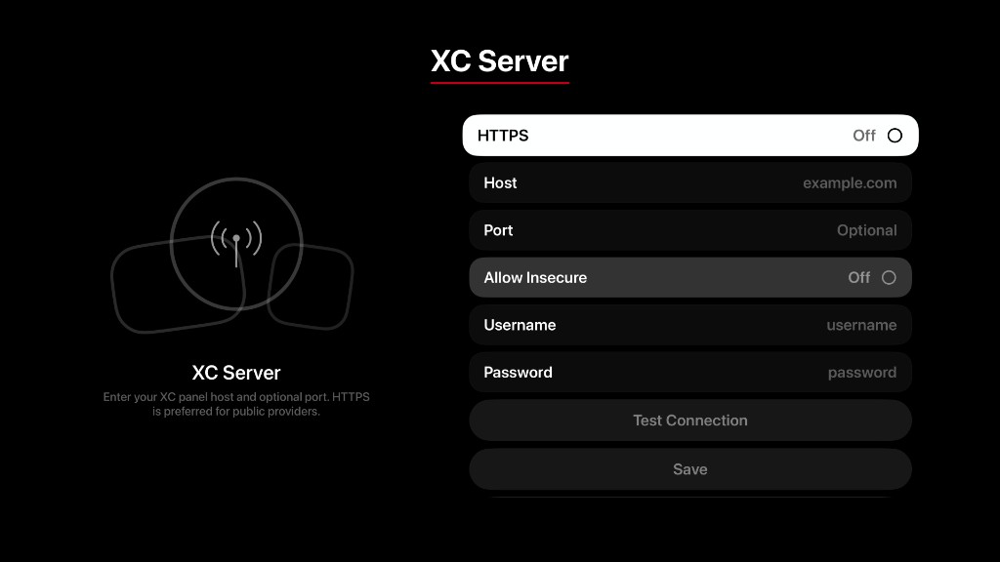
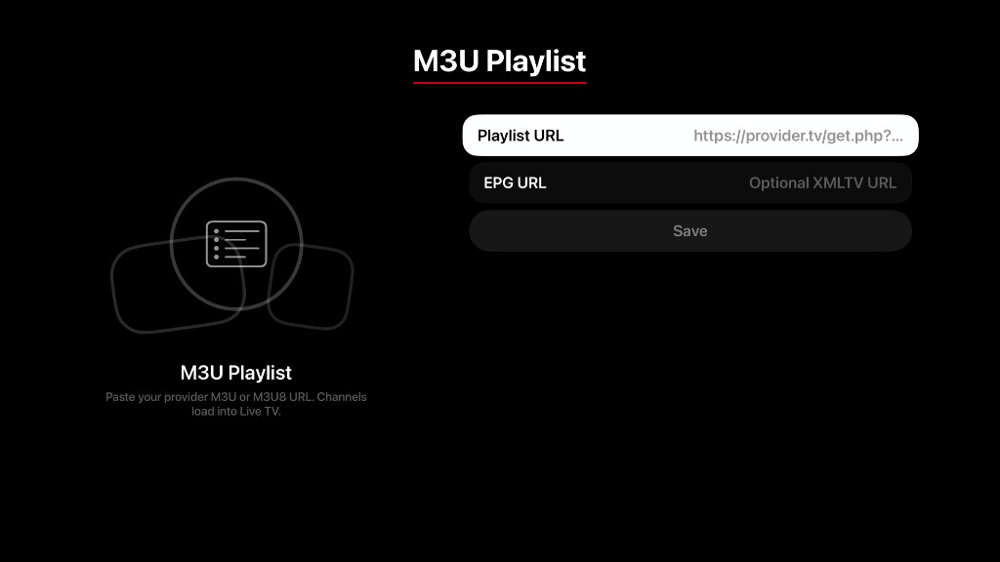

Paste a URL. 70k+ channel playlists parse without hanging. Handles CRLF line endings correctly (a lot of parsers don't). File-backed storage bypasses the UserDefaults size cap. Optional XMLTV EPG URL on the same screen.

XMLTV matched by `tvg-id`. External entity resolution disabled, since billion-laughs attacks are real for arbitrary EPG endpoints.

M3U and XC channels coexist in the same store via a separate ID namespace, so the channel list, EPG grid, favorites, and in-player navigation all treat them uniformly.

---

## iPhone & iPad

Same TestFlight build as Apple TV. Touch-first chrome, mini player, system PiP, and the custom tab bar live here. Shared sources, discovery, and Live TV behavior are covered above and below; this section is the phone/tablet surface.

### Player

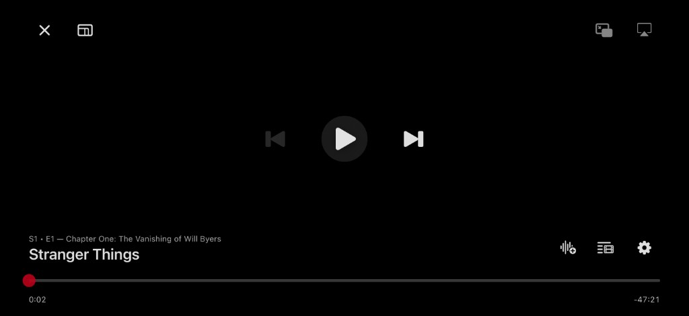
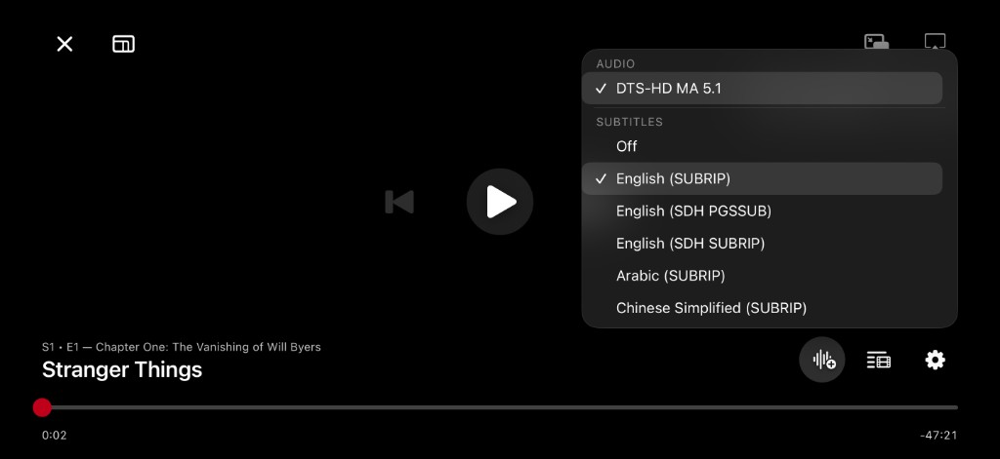

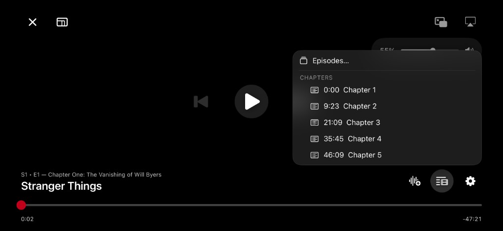
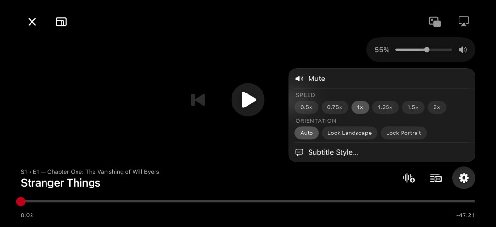

Consolidated iOS chrome (landscape). One transport / scrub / title surface; bottom-right opens the three common panels — audio & subtitles, episodes & chapters, and playback options (speed, orientation, mute, subtitle style) — instead of scattering those controls across the frame. Volume HUD still appears on left-edge drag / hardware buttons.

### Engine routing

**AetherEngine** (vendored FFmpeg demux + VideoToolbox) is the primary in-app engine on iPhone, iPad, and Apple TV for VOD and for non-HLS Live (raw `.ts`). It direct-plays MKV, HEVC 10-bit, and 4K HDR (HDR10, HDR10+, Dolby Vision) straight off Emby or IPTV with no transcode and no server remux.

**AVPlayer** handles HLS Live (`.m3u8`) and is the route for AirPlay / system PiP handoff when needed.

MobileVLCKit and MPVKit are gone from the shipping build (FFmpeg symbol collisions with Aether). Legacy enum stubs fall back to AVPlayer if ever selected.

### Options panel

Gear opens playback options: speed, orientation lock, mute, and subtitle style. Chip rows and toggle rows sit left-aligned so nothing overlaps. Audio/subtitle track picking and episode/chapter jumping live on their own buttons next to the gear (see the screenshots above).

### Skip Intro / Skip Credits

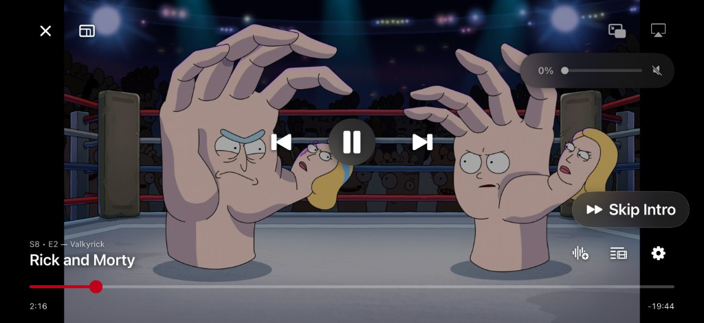

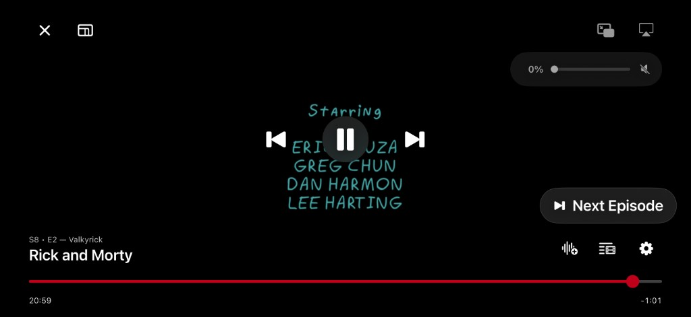

Auto-surfaces when the playhead enters a marked region, even if the chrome is hidden. Marker sources, in order: hand-curated entries, Emby chapter markers (typed Premiere markers first, then name heuristics like "Intro"/"Outro"), Plex `<Marker>` elements, and optional crowd lookup (TheIntroDB / IntroDB.app) under Settings → Playback → Skip Intro/Credits Lookup. When a next episode is queued, the credits control reads **Next Episode** instead of Skip Credits.

### Chapters

Emby titles with chapter markers expose a Chapters list from the episodes/chapters control (not buried in gear). Jump by chapter without leaving playback. Wired on every Emby movie Play path that should have them.

### Picture in Picture

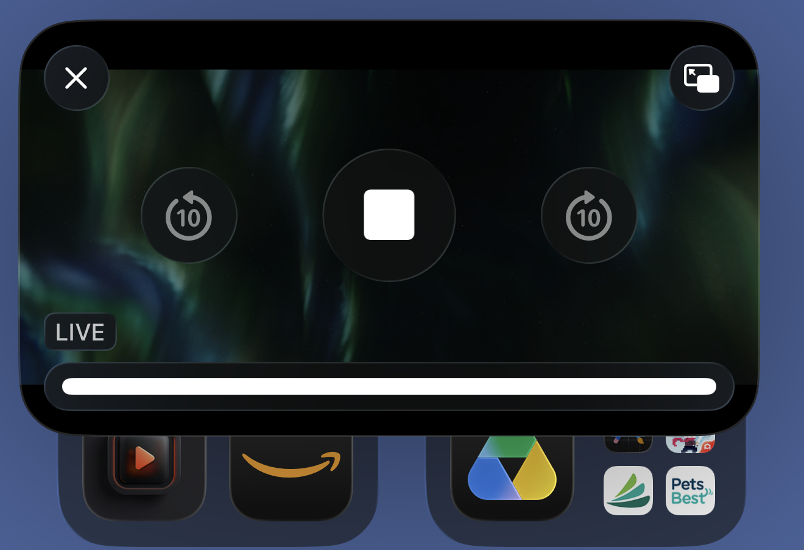

Aether sessions can enter system PiP (Home / Control Center, or the PiP control when shown). tvOS does not use this path the same way; keep expectations phone/iPad-first for floating PiP.

### AirPlay

On AirPlay activation for an Emby item, Apotheosis asks the server for an HLS transcode via `PlaybackInfo` and swaps to AVPlayer at the current position so the stream can cast. Swaps back when AirPlay disconnects. XC and M3U HLS already sit on AVPlayer-friendly paths more often.

Heads up: AirPlay receivers enforce ATS independently of iOS, so a self-signed-cert Emby on LAN can't AirPlay to Apple TV. Use a real cert (Let's Encrypt or a reverse proxy).

### Volume

Drag on the left side, or grab the HUD track directly. The visible bar is a real slider. Writes to actual system volume, not just per-player gain. Hardware buttons mirror the HUD in real time. If Apple ever closes the system-volume path, it falls back to per-player gain automatically.

### Brightness

Drag on the right side. Adjusts screen brightness without leaving the player.

### Mini player

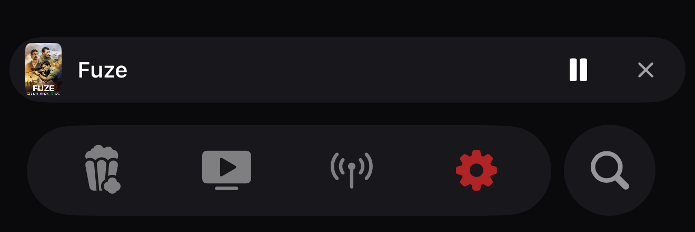

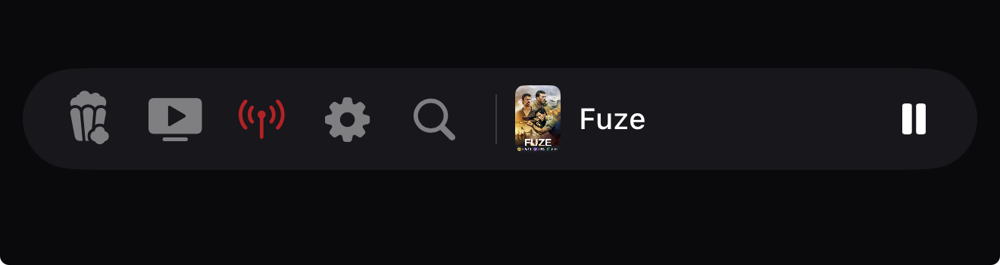

Engine stays alive while you browse. Three display states:

- Two-pill dock above the tab bar (normal).
- Compact inline pill when you scroll down. Tab icons compressed to the left, marquee title and play button on the right.
- Player-only pill on detail and settings pages where the tab bar is hidden.

Swipe down on the full-screen player to minimize, swipe up on the mini bar to expand, swipe down to dismiss. Final position reports to Emby on every transition.

### Tap-to-seek

Tap anywhere on the scrub bar to jump there. Drag for fine control.

### Episode navigation

In-player episode list, plus prev/next skip buttons. Same in-place URL swap. Chrome stays mounted, engine reloads, no dismiss animation. Auto-play-next rolls into the following episode at the end on Emby and XC series.

### Track persistence

Audio and subtitle preferences carry across episodes of the same series. Set Spanish audio on episode 1, episodes 2 through 12 open in Spanish.

### Auto-mark watched

Fires at 95% of runtime, settings toggle, default on. Matches VidHub's behaviour.

---

## Live TV

### EPG grid

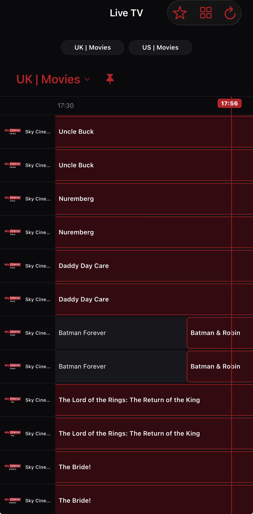

Sticky channel column, continuous horizontal time scroll, and a current-time indicator that follows the playhead. Slot width adapts to orientation: about 30 minutes visible in portrait, an hour in landscape, so 15-minute filler programmes on news, kids', or shopping channels render readably instead of compressed to one-letter stubs. The sticky time pill stays glued to the Now line through scrub, rather than snapping in hour-sized jumps.

Channels with empty or 503 EPG endpoints borrow programme data from siblings sharing the same EPG ID, so HD/SD/FHD variants of the same channel all populate even if only one has a working endpoint. If a channel comes back empty without a sibling to borrow from, it retries once after a delay (XC providers sometimes return empty under burst load at app launch; one quiet retry catches those).

Adjacent programmes that overlap in the schedule data (a "show A ends 13:05, show B starts 13:00" situation, common in XC feeds) get trimmed at ingestion so tiles butt up cleanly in the grid instead of stacking on top of each other.

Rows actively fetching show greyed placeholder tiles with a moving gradient sweep. Rows that came back empty show "No EPG data" with a small icon at the leading edge, so you can tell at a glance whether to wait or move on. The shimmer runs on Core Animation, which keeps the sweep smooth even while the main thread is busy decoding the rest of the EPG batch.

### Large channel sets

Some IPTV providers dump 30,000+ channels into a single category, which is more than the EPG grid can render without running out of memory. Above 1,500 channels in one view, Apotheosis switches to a virtualized browser instead: a flat list or a card grid, your pick, with the choice remembered. Drop back under the threshold and the full guide returns on its own.

A search field filters the loaded channels by name as you type, with no network round-trip. Names honor your custom renames, same as everywhere else, and VOD-style titles get cleaned up: "War Machine 2026 [1080p] [BluRay]" reads as "War Machine 2026" with the quality tucked underneath, so two copies at different qualities stay easy to tell apart. Live channels fill in what's on now as you scroll, fetched a few at a time so even a huge playlist doesn't hammer your provider; entries with no program guide (most VOD) skip the fetch.

### Quick Chips

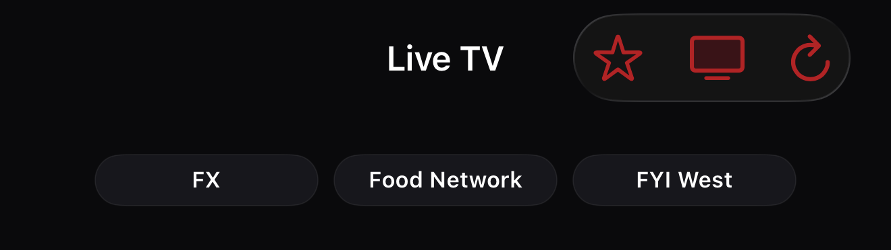

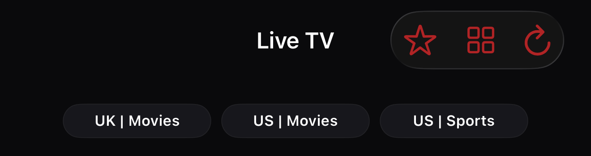

Pinnable shortcuts above the category dropdown. Two modes: channel pins for one-tap-to-play, or category pins for one-tap-to-filter. Independent lists per mode. Cap is 10 per mode, scrollable horizontally when chips exceed the visible row. Long-press any chip to remove it with a brief toast confirmation.

The current category has its own pin button next to the dropdown title, so you can add or remove the category you're already browsing without going into Settings. Channel pin/unpin from the EPG long-press menu fires the same toast. If you're in the wrong chip-kind mode when you pin, the toast tells you where the new chip will appear.

### In-player channel nav

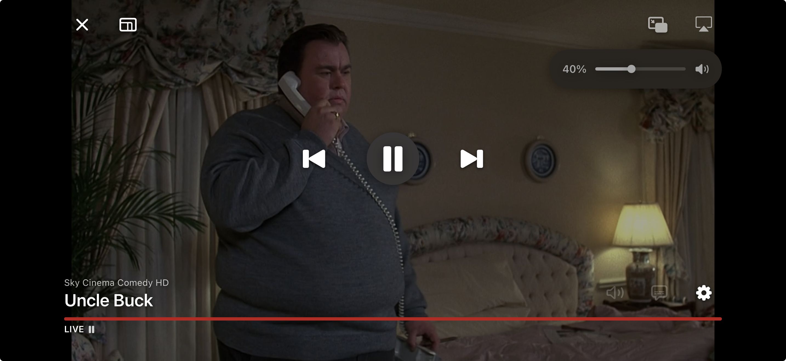

Prev/next channel buttons replace seek controls on live streams. Order follows the active EPG filter. If you're in Sky Sports and tap next, you get the next Sky Sports channel, not the next channel in the full list. In-place swap, no dismiss animation.

---

## Discovery

### Sibling versioning

| **Apotheosis** | **Infuse** |
|:---:|:---:|
| 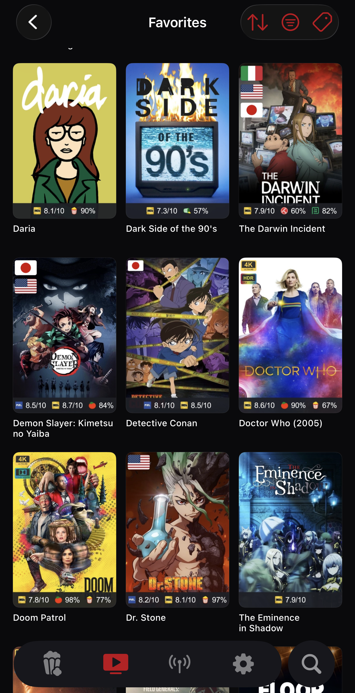 | 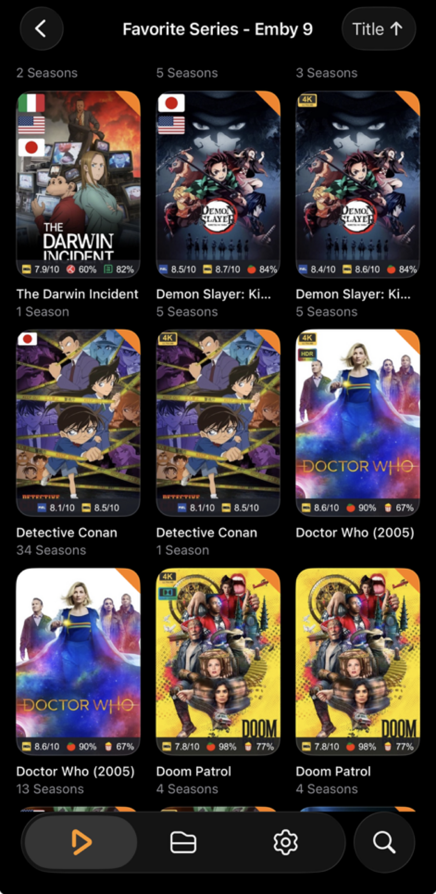 |

Multi-encode libraries are common in IPTV-plus-personal-server setups. Your Emby has separate 4K and 1080p folders. Your IPTV provider lists the same movie at three resolutions. Most clients show all of them, so the same title sprawls across rails, fills CW with duplicates, and ends up with a watched checkmark that only applies to one variant.

Apotheosis collapses them into a single tile across every grid, every CW rail, every search result. The detail page version picker (iOS list under Play; Apple TV Version panel) lets you switch encodes. The CW play button respects whichever you picked last, and marking either version watched clears both. Server data is untouched; the dedup is purely client-side, so your Emby web client still sees each version separately if that's how you want to browse there.

Count the duplicates above.

### Continue Watching

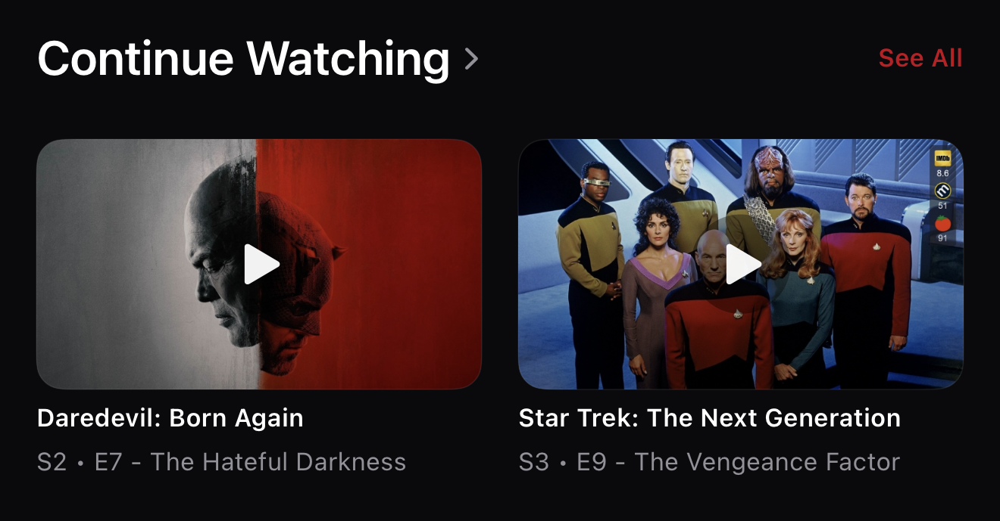

Hero carousel, two cards visible. Tap the centred play button to resume directly. Tap anywhere else to open detail.

Cross-source: Emby, Plex, and XC VOD share one rail. The sibling-aware dedup covered above keeps the rail clean when the same title exists in multiple places. The tile flips to whichever version you played most recently, so the artwork you see matches the version that actually plays.

### Custom Rails

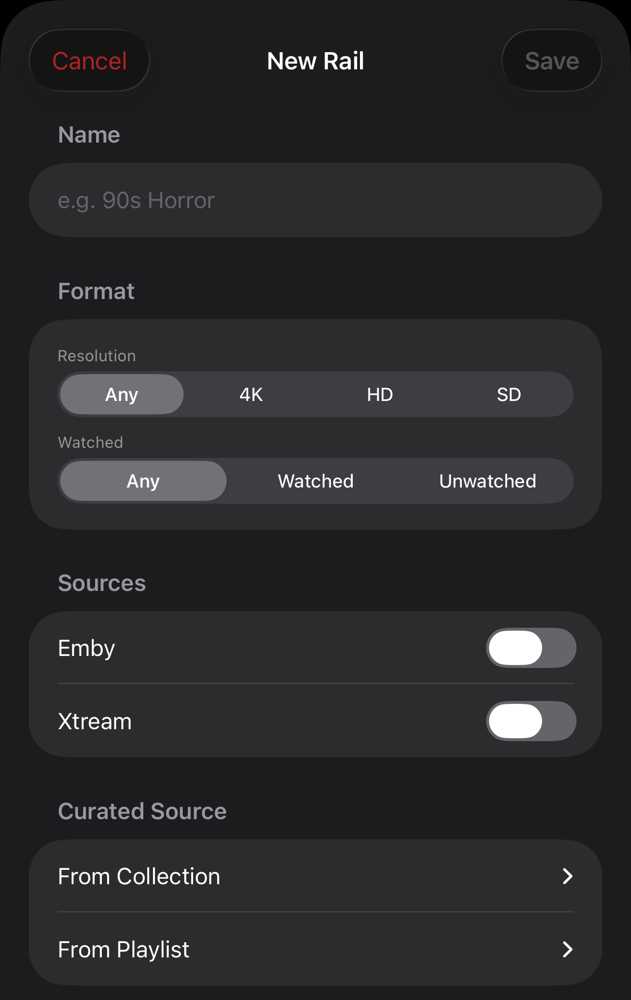

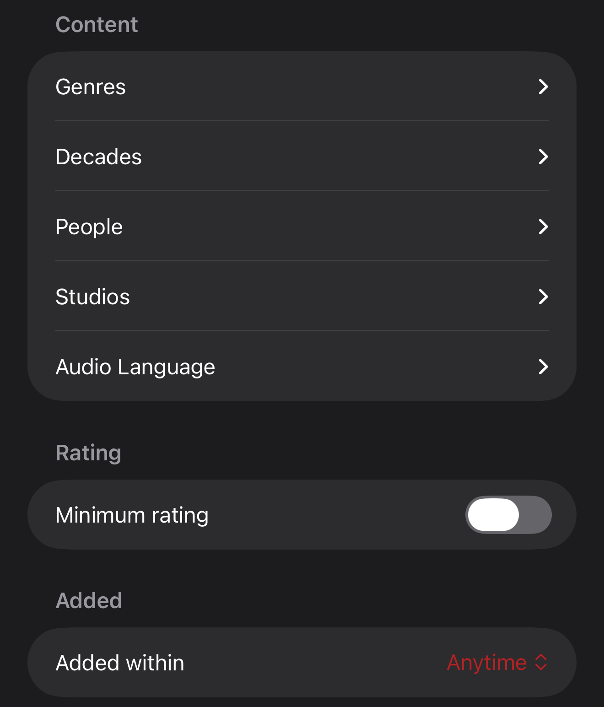

Composable filter rails on the discovery screen. 11 axes available: genre, decade, source, person, rating floor, resolution, watched state, recency, studio, audio language, and curated source (Emby BoxSets or Playlists).

Person autocompletes against the Emby cast/crew index. Type "Villeneuve" and get a filmography rail.

### Online Enrichment (TMDB)

Optional, BYOK. Settings → Library → Online Enrichment. Paste your own TMDB API key; the app talks to TMDB directly from the device. Used for clear logos, missing synopsis, cast portraits, and selected-season episode-still backfill when the provider's art is thin. Provider episode art wins by default; TMDB fills gaps. Artwork cache size presets and Clear Artwork Cache live in the same Library settings area.

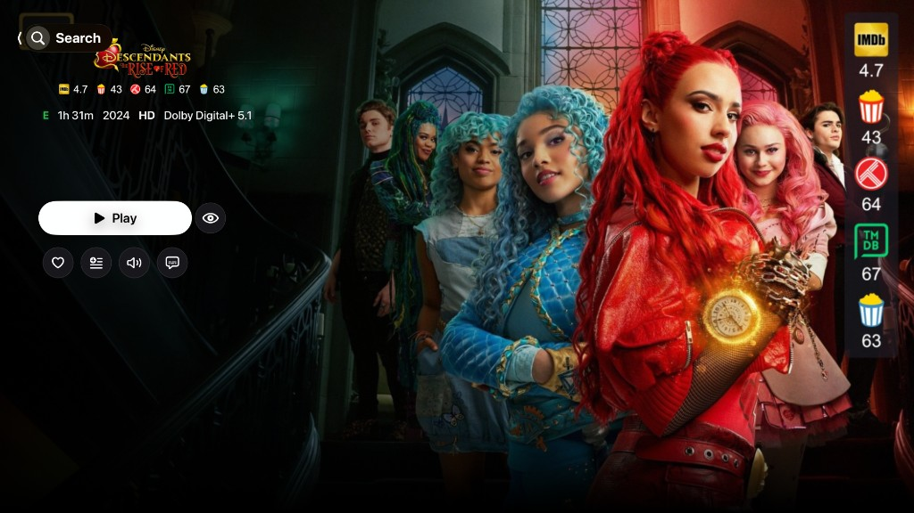

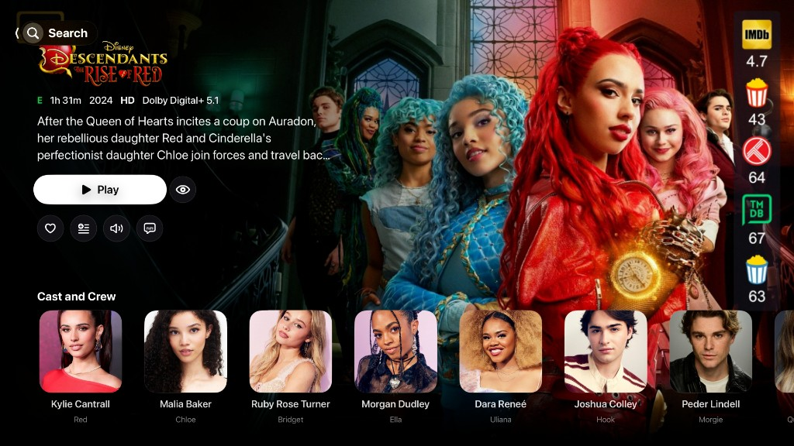

Same title on Apple TV — enrichment off, then on. What changes is the fill-in: clear logo, synopsis, and cast portraits. Score badges on the backdrop (IMDb / TMDB / etc.) are burned into the server artwork, not UI Apotheosis draws — see the note under Rating badges above.

### Detail pages

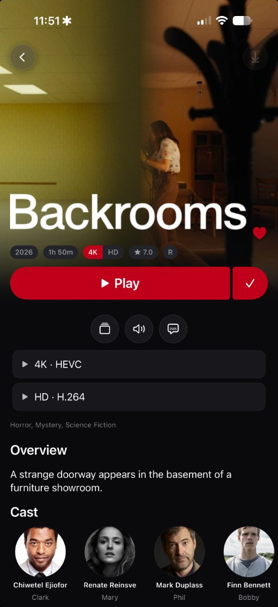

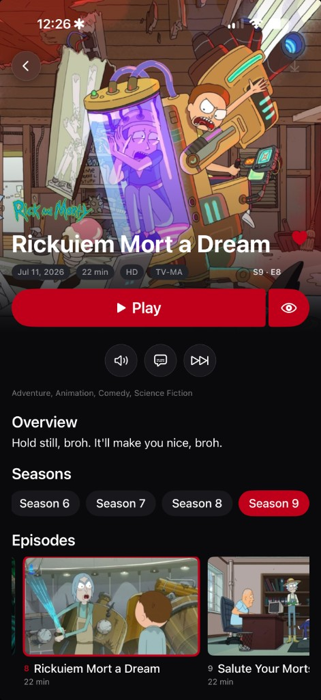

Movie detail with the version list open under Play (4K / HD), plus overview and cast. Series detail adds season chips and an episode rail (selected episode highlighted). Apple TV variants below.

### Genre, Favorites, Collections, Playlists, Recently Added

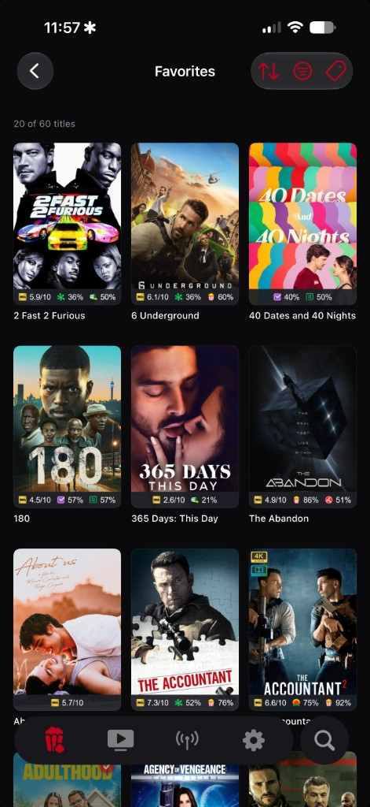

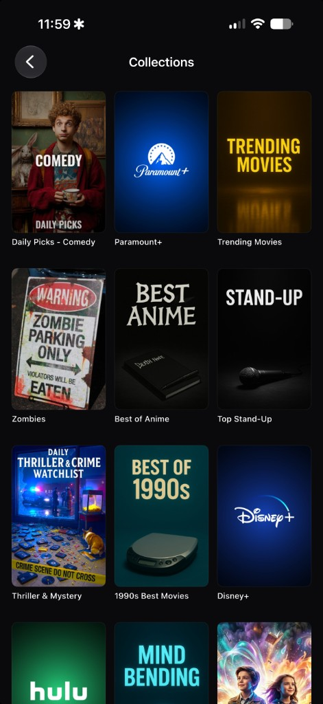

Nav chips above the rails, each opens a full grid with sort overrides, source filtering, and genre filtering. Genre chips come from your library's actual tags, sorted by item count descending. Synonym folding (e.g. Kids / Children / Children's → Family) keeps the chip list sane.

### Library load

First 1000 items per library load immediately. Anything beyond that fills in the background while the UI is already showing the first page. Capped per library at 5000. Libraries beyond that are almost certainly not personal collections.

### See All

First 100 items paint immediately, next 100 trigger as you scroll near the end. No artificial cap. Favorites shows a floating "Loading more…" toast on load-more; other See All grids keep an in-grid spinner while the next page loads.

Title sort ignores leading articles. "The Pact" lands under P, not jammed into a wall of "The X" entries. Applies to the Title A→Z / Title Z→A sort and every tie-break that breaks on title (Date Added, Year, Rating).

### Watched state

Watched posters dim to 50% with a checkmark overlay. Recently Added hides watched items entirely. Other rails keep them visible-but-dimmed so rewatch is still findable.

### Mark watched up to

Long-press an episode card in series detail to mark every prior episode (plus that one) as watched. Same menu has full-series and full-season variants. Useful when you finally start tracking a show you watched ages ago.

Season chips on the series detail page have their own long-press for full-season marking, without needing to tap into the episode list. A toast confirms the action since the season's episodes may not be visible on the current surface.

### Feel / performance

Discovery snapshots paint on tab re-entry while a background refresh runs, so you don't get a full-screen spinner over content you already had. Warm Movies ↔ Series switches reuse decoded poster and hero bitmaps in memory so you're not paying JPEG decode again every bounce. Clear Artwork Cache empties that decoded cache too.

---

## Search

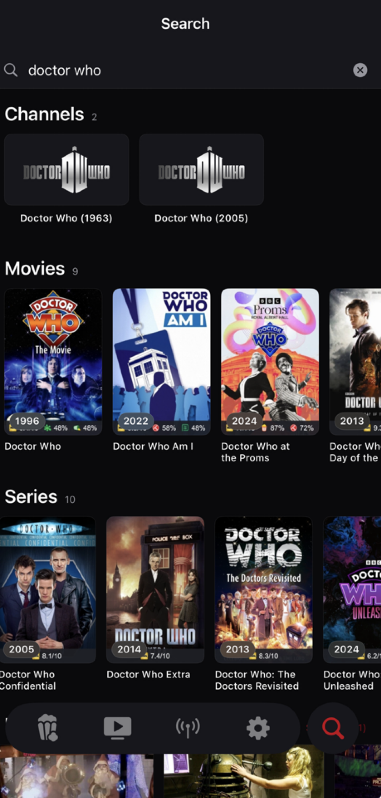

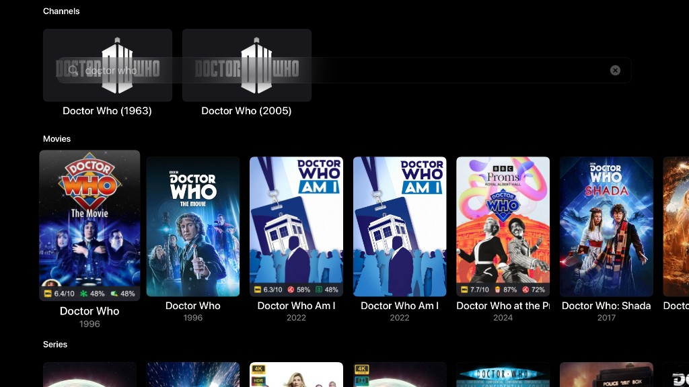

Top-level tab with its own Liquid Glass circle next to the main pill (Apple Music / iOS 26 pattern). Searches across every configured source from one place. Five sections render in priority order:

- **Channels.** Live channel name matches. Tap to play.
- **On Now.** Programmes currently airing that match the query. Tap plays the parent channel; the search results act as the player's prev/next channel context.
- **Upcoming.** Programmes starting within the next 24 hours, with a relative time badge ("in 45m", "Tomorrow 9:00 PM").
- **Movies, Series, Episodes.** VOD results from Emby, Plex, and XC combined. Cap of 20 per section with a "See All" pivot that expands without a second fetch. Episode stills can backfill from TMDB when the provider left them blank.

Every result card has a long-press menu tuned to its type. Live cards offer Play Now, Go to EPG (jumps to LiveTV with the channel's category selected), Favorite, and Pin to Quick Channels. Movie cards offer resume-aware Play (centered "Continue watching?" prompt when there's a saved position), Favorite, Mark Watched, and Add to Playlist for Emby items. Series cards offer Play (auto-resumes the most recently progressed episode), Favorite, and Mark Series Watched. Episode cards offer Play, a Mark Watched submenu (Episode / Season / Up to This Episode), Series-scoped Favorite, and Add to Playlist. Toast confirms every action since the search surface doesn't reflect favorite or watched state visually.

Punctuation normalization handles iOS Smart Punctuation. Typing "guy's grocery games" with the smart-curly apostrophe and "guys grocery games" with no apostrophe both find the same titles. Same logic applied on both sides of every match, plus on the term sent to Emby's server-side search.

Opening the Search tab triggers a background EPG warm-up for your priority channels, capped at 20. Without it, Live programme matches would require a prior Live TV visit to populate the cache. When coverage is sparse, a small caption under On Now and Upcoming points back to Live TV to load more.

The Search circle has an 8pt invisible tap-padding extending past the visible edge, so glances that land slightly outside the button still hit Search instead of the content underneath.

---

## Apple TV

Same TestFlight build as iPhone (Universal Purchase). Not a touch port: focus, the Siri Remote, and Menu-button hierarchy were rebuilt for the living room. Same sources, same data layer, same Continue Watching and dedup as the phone. Pair from your iPhone over the local network so you set servers up once and never type a URL with the on-screen keyboard. (Discovery hero is the lead image at the top of this file.)

### Player

Same AetherEngine stack as iPhone: MKV, HEVC 10-bit, and 4K HDR straight off Emby or Xtream with no transcode. Both 1080p and 4K HDR confirmed on Apple TV 4K.

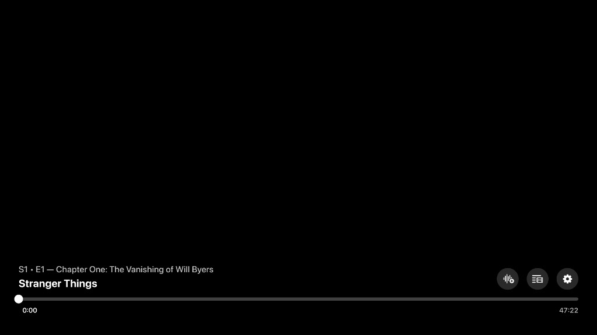
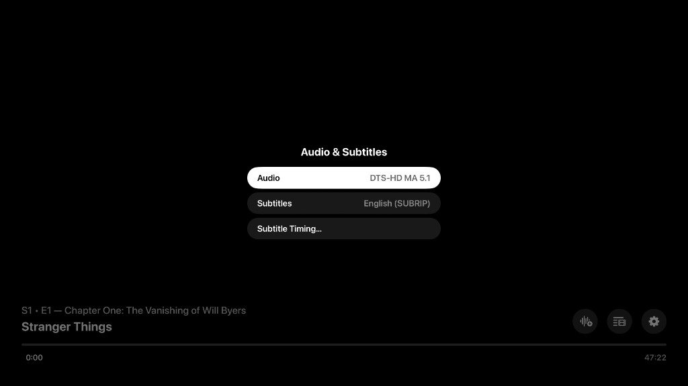

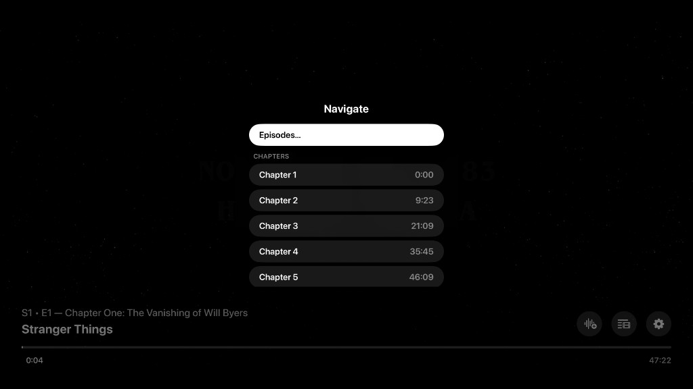
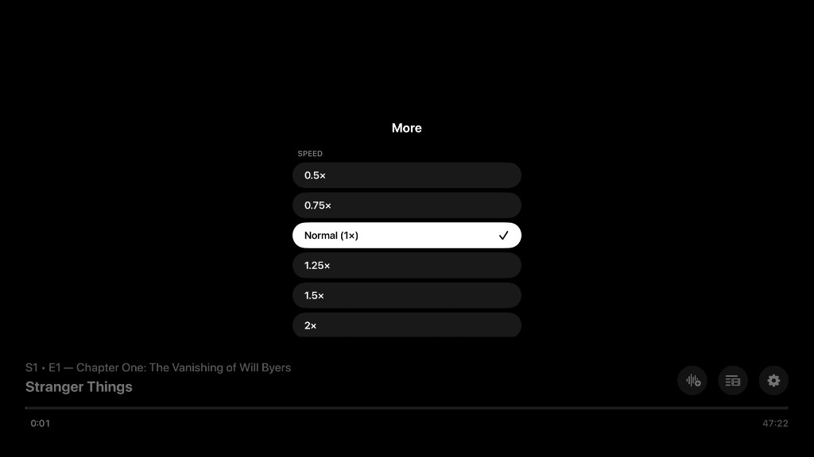

Built for focus, not touch — same consolidation idea as iOS, remote-first. Scrub bar driven with the D-pad (accelerates as you keep pressing; a readout under the playhead shows where each jump lands). Bottom-right opens the three common surfaces: Audio & Subtitles (plus subtitle timing), Navigate (Episodes… + CHAPTERS when present), and More (playback speed). Season/episode browsing stays a two-pane focus flow from Navigate. Audio tracks a provider labels only "eng" get the codec and channel layout appended ("English AC3 5.1") so you can tell them apart. Title stays out of the way: episode caption above, series name below.

### Skip Intro / Next Episode

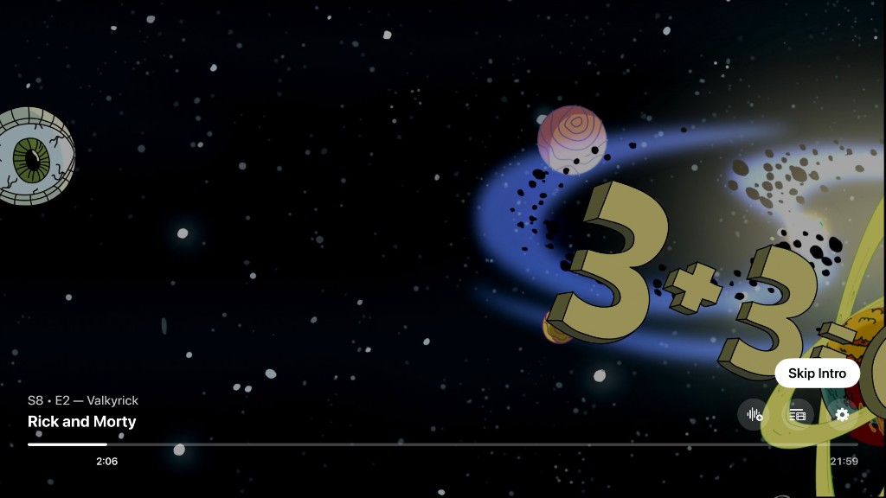

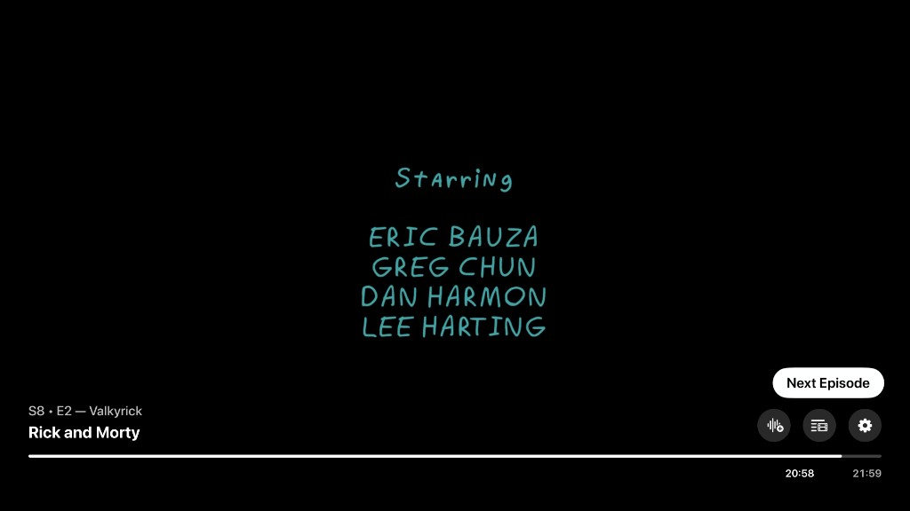

Same marker-driven Skip Intro / Skip Credits / Next Episode affordance as iOS. Buttons sit above the bottom-right control cluster. Episodes also auto-advance at the end on Emby and XC series, with the episode picker reachable mid-playback.

### Detail pages

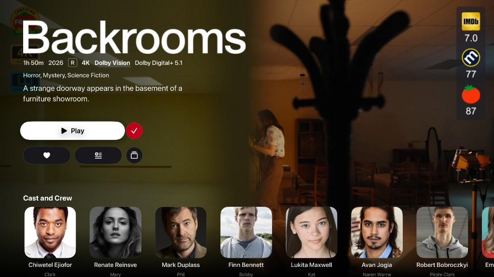

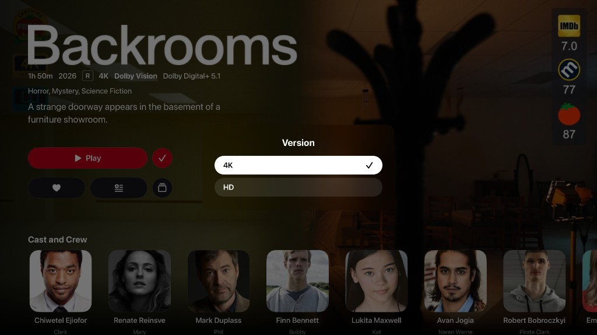

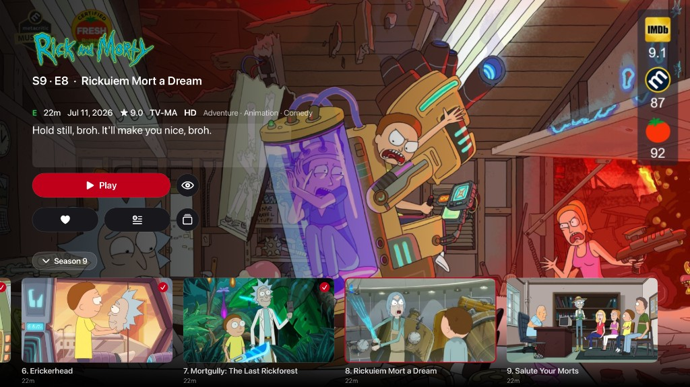

Movie detail without and with the Version panel open. Series detail shows clear logo, episode caption, season picker, and the episode rail with the focused episode highlighted.

### Favorites and Collections

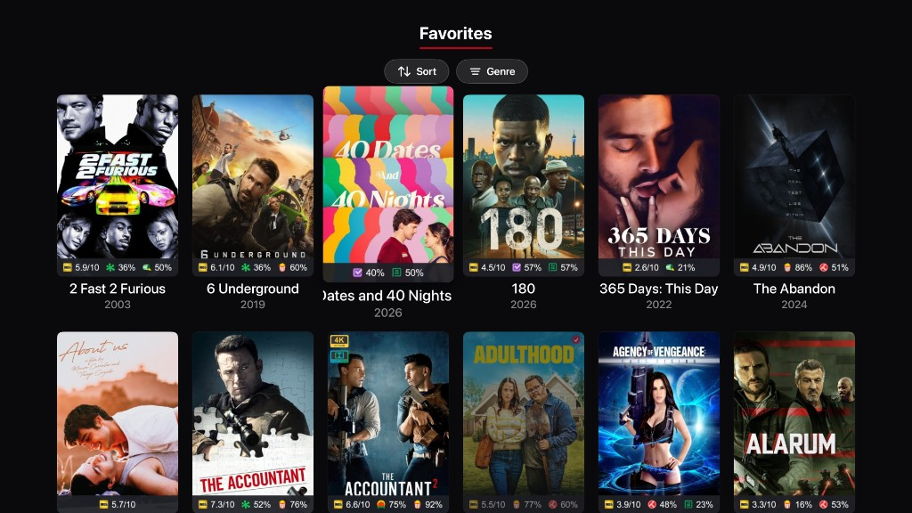

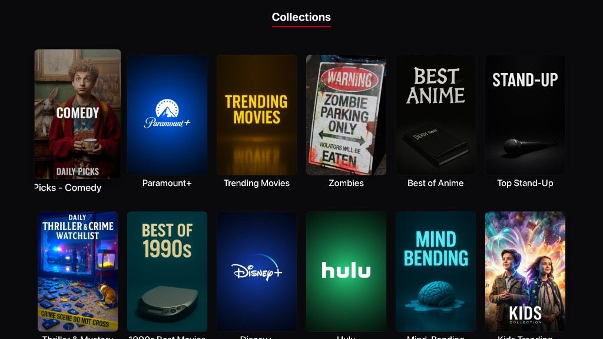

### Live TV

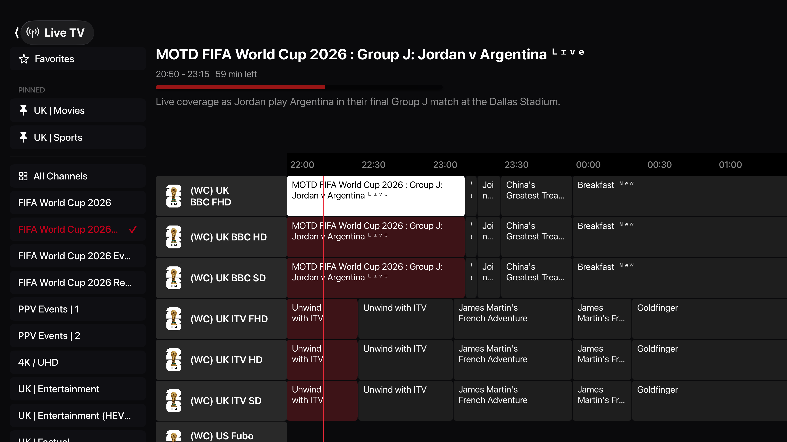

The EPG is a real two-axis grid, built as a UIKit collection view since SwiftUI's scroll grids don't render reliably on tvOS at this scale. Channels pin to a fixed left column, the timeline scrolls, there's a now-line, and you can favorite or pin a channel right from the grid. Categories live in a column down the left. Live plays through the same custom chrome with a LIVE badge where the scrubber would be.

### Discovery and library

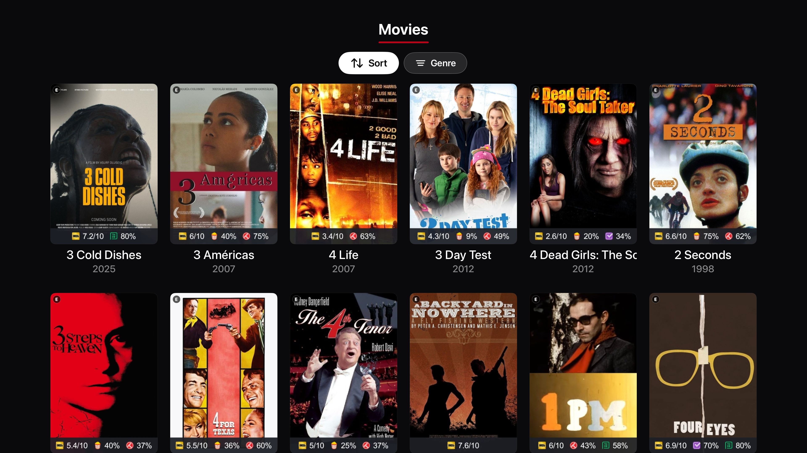

A full-bleed discovery hero (backdrop, clearlogo title, an action cluster, an edge-paged carousel that rotates) over big-poster library grids. Sort and Genre are focus-driven pickers. Detail pages for Movies, Series, and XC Series all match each other. Sidebar reselect pops to root; focus returns to Play after a sidebar trip when it can.

### Navigation and Menu

The sidebar of tabs collapses into the content once you pick one. The Menu button walks back up the hierarchy the way you'd expect: from the content up to the row above it, then one more press reopens the sidebar. Same shape in Settings (content to menu column to sidebar) and Live TV (EPG to category column to sidebar).

### Settings

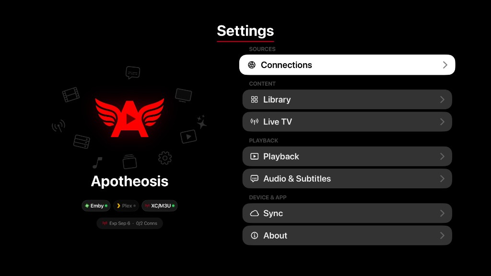

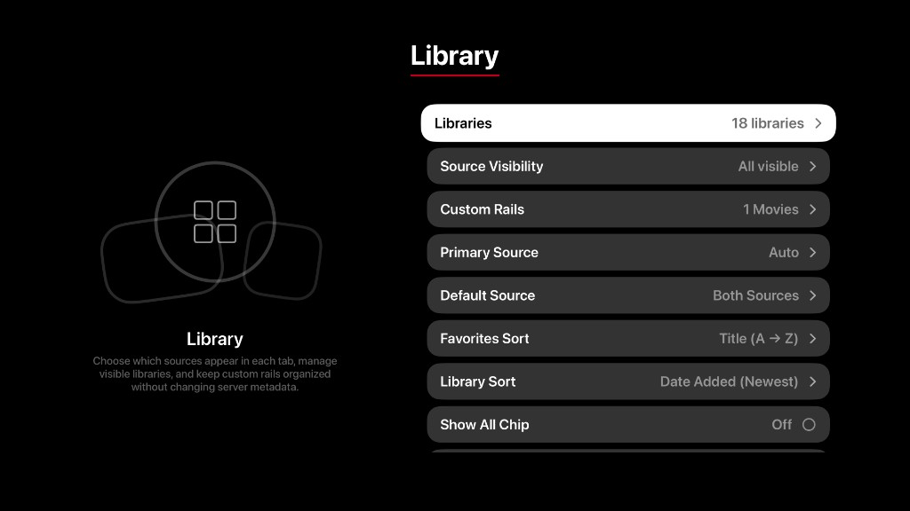

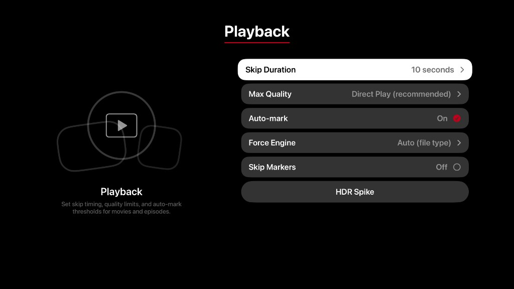

Full-screen two-pane layout: branding / section explainer on the left, focusable rows on the right. Root Settings (Connections, Library, Live TV, Playback, Sync, About…) drills into the same two-pane shape for Library, Playback, and the other categories. About has a GitHub Sponsors QR, "Report an Issue or Idea" (QR to the public tracker), and a redacted in-app quick diagnostic (Submit Quick Diagnostic sits at the bottom of About).

---

## Navigation

### Custom tab bar

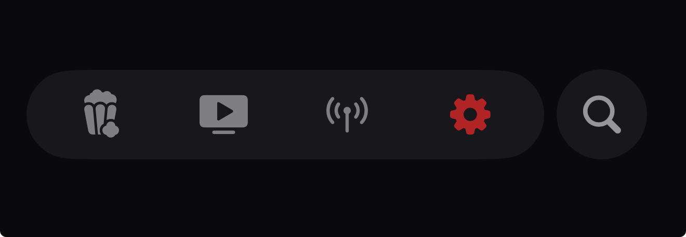

Replaces the system `TabView`. Movies, Series, Live TV, and Settings live in the main pill; Search sits in its own circle to the right. The iOS 26 Liquid Glass tab bar paints a persistent dark band that no SwiftUI or UITabBar API can remove. Apple DTS confirmed as intentional. The custom bar sidesteps this entirely.

### Slide to switch

Drag horizontally across the tab bar to glide between tabs. Light haptic per crossing. Tooltip swaps to the hovered tab's label immediately.

### Pop to root

Tap the active tab to pop back to its discovery view. Works for any push (drill-downs, See All, library views), regardless of how they were added.

### Tab bar behaviour

Hides on scroll-down with a 12pt threshold, restores on any upward scroll. Hides on drill-down pages where the active surface doesn't need tab context.

---

## Infrastructure

**Catalog cache.** Full library catalog persisted locally. Cold launch paints from cache in under 2 seconds on 30k+ item libraries.

**Discovery cache.** Snapshot written after each successful load. Tab re-entry renders from cache while a background refresh runs (no spinner over already-painted rails).

**Decoded artwork cache.** In-memory bitmap cache for posters and hero backdrops so warm tab switches skip JPEG/PNG re-decode. Cleared with Settings → Library → Clear Artwork Cache.

**Channel store.** File-backed (UserDefaults isn't built for 70k channels). iCloud snapshot trimmed to user-touched channels only (favorites, hides, pins), so KVS quota doesn't matter.

**Log buffer.** 500-entry actor-based ring buffer for live viewing, backed by an on-disk log that rotates each launch. So if the app restarts unexpectedly, a bug report can carry the previous session's log, the lead-up to whatever happened, not just the fresh one. Both are redacted before they leave the device. Console prints are gated to Debug builds only.

**Privacy.** No analytics, no tracking SDK, no third-party crash reporter that phones home. Bug reports and feature requests go through a Cloudflare Worker that creates GitHub Issues server-side, so the GitHub token never ships in the binary.

---

## Things worth knowing about security

This app holds credentials for servers you don't own: Emby logins, XC subscriptions, M3U URLs, stream tokens. The threat model is closer to a password manager than a typical media app, and it's built that way deliberately.

- **No backend.** Apotheosis talks directly to your servers. There's no Apotheosis-controlled cloud holding anything about you.
- **No analytics, no tracking SDK, no third-party crash reporter that phones home.** Every dependency that exists in the app is there to render media or talk to your servers, not to phone home about you. This is also a supply-chain control. Anything that phones home is an exfiltration vector for the credentials this app holds.
- **Credentials live in the Keychain** with a device-bound accessibility class. Per-profile isolation so a leak from one server doesn't compound across all of them. Optional iCloud Keychain sync for credentials is off by default (Settings → Sync); turning it on is an explicit threat-model trade-off you confirm in UI.
- **TLS posture.** Your credentials and server API traffic still require encryption on the open internet: a cleartext (`http://`) login or API call is only allowed to a private or LAN host you've explicitly opted in, flagged with an "Unencrypted" badge on that server row in Settings. Public cleartext carrying credentials is refused. The opt-in covers the common self-hosted case (RFC 1918, link-local, `.local`, loopback, plus Tailscale's `*.ts.net` and the `100.64/10` range, since WireGuard already encrypts the transport), and self-signed certs on those hosts are handled the same way, per-profile and fail-closed. What's deliberately not forced to HTTPS is the video stream itself: IPTV providers routinely redirect a stream request to a cleartext signed-token CDN, and the player has to follow that hop or nothing plays, so stream bytes travel the way every IPTV client allows them to. And on first connect Apotheosis records the Emby server's identity, its GUID plus cert fingerprint: a renewed cert gets a one-time notice, but a different server answering at the same address stops and asks before you trust it.
- **Bug reports redact credentials.** The in-app reporter strips anything that looks like a URL, token, or stored credential before it leaves the device. The pipeline that creates GitHub Issues holds nothing identifying server-side. Feature requests are public-facing: don't paste secrets into those free-text fields either.

The full security spec lives in `CLAUDE.md` / `AGENTS.md` at the repo root. If you've ever sideloaded an IPTV app that uploaded your credentials somewhere shady, you'll appreciate the difference.

---

## Things worth knowing if you read the code

- `ItemKey` is the stable cross-source identity that threads through Resume, Favorites, TrackPreferences, and in-player nav. Don't bypass it.
- `PlayerControls` is engine-agnostic. The chrome doesn't know whether AetherEngine or AVPlayer is rendering.
- System volume control is a grey-area MPVolumeView path. The fallback to per-player gain is automatic.
- Setting Emby audio/subtitle indices forces transcode mode. Only emit those parameters on explicit user intent.
- Emby movie Play ingresses (detail, CW, long-press, Search, library menus) should go through `EmbyPlayback.playMovie` so chapters / HDR / skip markers stay hydrated.
